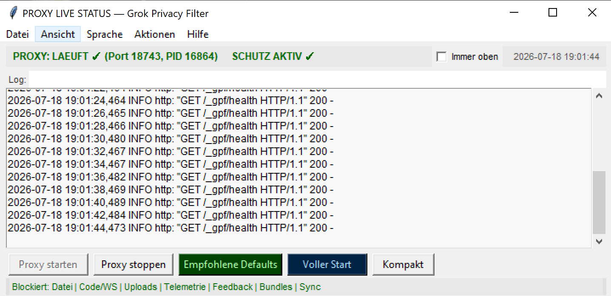

# Grok Privacy Filter

**Community-Schutzmassnahmen** für die [Grok Build CLI](https://x.ai) (xAI):  
weniger unnötige Uploads, Coding-Data-Retention **Opt-out**, Agent-Hook, lokaler **Default-Deny-Proxy**.

> **Zwei Wege:**
> - **Einfach (empfohlen für die meisten):** `install_easy.*` + **Live-GUI** (5 Min, ein Schalter)
> - **Fortgeschritten / VS Code:** `install_all.ps1` + volle Kontrolle

> **English (short):** Local tools to harden Grok Build: server-side coding-data retention opt-out, config lockdown, PreToolUse hook against agent uploads, and a path-filtering reverse proxy in front of `cli-chat-proxy.grok.com`. This does **not** stop chat inference (product needs it) and does **not** prove server-side deletion. Full guide: [`docs/INSTRUCTIONS.md`](docs/INSTRUCTIONS.md) · Limits: [`docs/LIMITS.md`](docs/LIMITS.md). Deutsche Version: [README.de.md](README.de.md).

---

## Warum das existiert

Im Juli 2026 wurde öffentlich dokumentiert, dass Grok Build u. a. **Repository-Inhalte** (Git-Bundle) an Cloud-Storage senden konnte — unabhängig davon, welche Dateien der Agent „gelesen“ hat. xAI verwies u. a. auf **`/privacy`**, ZDR (Enterprise) und spätere Server-Flags.

Dieses Repo bündelt **sofort nutzbare** Gegenmassnahmen für Einzelpersonen:

| Schicht | Werkzeug | Wirkung |
|--------|----------|---------|
| 1 | `config/privacy-opt-out.py` | API: `codingDataRetentionOptOut=true` |
| 2 | `config/config.snippet.toml` | Telemetry/Trace/Prefetch/Indexing + **endpoints-Proxy** |
| 3 | `hooks/block-xai-upload.*` | Agent-Tools dürfen nicht zu xAI/GCS pushen |
| 4 | `proxy/xai_filter_proxy.py` + `ensure_proxy.py` | Default-Deny-Proxy; startet nur wenn nötig |
| 5 | Autostart / VS Code Task | Proxy bei Login bzw. beim Öffnen des Workspace |
| 6 | (optional) Firewall | Nur Auth + lokaler Proxy — siehe Docs |

**Live-GUI (empfohlen für normale Nutzer):** `proxy/live_proxy_gui.py` (wird bei der Installation nach `~/.grok/proxy/` kopiert)

- Menüleiste (Datei / Ansicht / Aktionen / Hilfe / Sprache) für sekundäre Funktionen
- Oben: Status-Anzeigen (PROXY / SCHUTZ), Uhrzeit, Checkbox „Immer oben“
- Farbiges Banner mit Block-Liste bei aktivem Schutz
- Log-Bereich mit farbiger Markierung (ALLOW/BLOCK)
- Unten: Direkte Buttons: Proxy starten, Proxy stoppen, Empfohlene Defaults, Voller Start, Erweitert (umschaltet Modus + Fenstergröße)
- Statusleiste unten für Feedback
- Voll bilingual (Deutsch / English), umschaltbar im Menü
- Einstellungen nur über Menü (Datei → Einstellungen...)
- Dynamische Pfade, sofortiges visuelles Feedback bei Aktionen, Buttons werden deaktiviert wenn nicht nutzbar

**Preview der Live-GUI:**



Start: Doppelklick auf die Desktop-Verknüpfung oder `python proxy/live_proxy_gui.py` (bzw. `~/.grok/proxy/start_live_gui.*`)

Das ist der einfache Weg: ein Schalter für den kompletten Exfiltrations-Schutz. Keine 20 Presets.

**Scope (ehrlich):** Filtert Pfade auf `cli-chat-proxy` (Storage/Upload default-deny).  
Chat/Inference bleibt nutzbar. Blockiert **nicht** magisch alle Hosts der Welt und beweist **keine** Server-Löschung.  
Siehe [docs/GRENZEN.md](docs/GRENZEN.md).

**Kein Marketing:** Firewall auf die ganze `grok.exe` = CLI tot.  
**Proxy** = CLI/Extension nutzbar + Upload-Pfade auf dem Chat-Host blocken.

---

## Schnellstart (5 Minuten)

### Voraussetzungen

- Grok Build installiert und einmal `grok login`
- Python **3.10+** (`python` / `python3` / Windows `py -3`)

### 1. Einfacher Weg (empfohlen für die **meisten Nutzer**)

```powershell
git clone https://github.com/chrisX1982/grok-privacy-filter.git
cd grok-privacy-filter
powershell -ExecutionPolicy Bypass -File .\scripts\install_easy.ps1
```

**Die Live-GUI öffnet sich automatisch.**  
Klicke „Empfohlene Defaults“ oder „Voller Start“ (empfohlen).  
Danach immer per Desktop-Verknüpfung „Proxy Live Status“.  
Sprache umschaltbar im Menü „Sprache“.

In Grok: `/hooks-trust` (dem lokalen Hook vertrauen).
Dann `/hooks` öffnen und `r` drücken zum Reload.
In der GUI: Menü Aktionen → "Hooks prüfen" zum Verifizieren der Installation.

> **GUI ist der Standard-Einstieg.** Alles andere ist optional für Power-User.

### Windows — für VS Code / fortgeschrittene Einrichtung

```powershell
git clone https://github.com/chrisX1982/grok-privacy-filter.git
cd grok-privacy-filter
powershell -ExecutionPolicy Bypass -File .\scripts\install_all.ps1 -Workspace "C:\Pfad\zu\deinem\Projekt"
```

Danach in Grok: `/hooks-trust` (dem lokalen Hook vertrauen).
Dann `/hooks` öffnen und `r` drücken zum Reload.
In der GUI: Menü Aktionen → "Hooks prüfen".

| Script | Zweck |
|--------|--------|
| **`install_easy.ps1`** / `.sh` | **Empfohlen für die meisten** (Hook + Proxy + GUI + Opt-out + startet GUI) |
| `install_all.ps1` | Alles in einem Rutsch (inkl. VS Code + Autostart) |
| `install.ps1` | Hook, Proxy, policy, Config-endpoints |
| `install_vscode.ps1` | Task folderOpen + User-Settings |
| `install_autostart.ps1` | Login + optional Watchdog |
| `ensure_proxy.py` | Start nur wenn noetig; `--watchdog` |
| `uninstall.ps1` | Sauber entfernen |

### Windows — nur Terminal-TUI (optional)

```bat
scripts\start_proxy.cmd
scripts\start_grok_filtered.cmd
```

Mit `cli_chat_proxy_base_url` in der Config reicht oft nur `ensure_proxy` + normales `grok`.

### macOS / Linux (einfach)

```bash
git clone https://github.com/chrisX1982/grok-privacy-filter.git
cd grok-privacy-filter
bash scripts/install_easy.sh
```

Oder manuell: `bash scripts/install.sh` + opt-out + ensure.

# VS Code: docs/VSCODE.md — vscode/tasks.json nach .vscode/ kopieren

### Prüfen

```powershell
# Windows
powershell -ExecutionPolicy Bypass -File .\scripts\verify.ps1
```

```bash
curl -i http://127.0.0.1:18743/v1/storage   # erwartet: 403
curl -i http://127.0.0.1:18743/v1/models    # Upstream (z.B. 401 ohne Token = OK)
```

In Grok: `/hooks` → Reload → **block-xai-upload** aktiv.

---

## Ordnerstruktur

```text
grok-privacy-filter/
├── README.md
├── README.de.md
├── LICENSE
├── config/
│   ├── config.snippet.toml      ← inkl. [endpoints] Proxy-URL
│   └── privacy-opt-out.py
├── docs/
│   ├── ANLEITUNG.md
│   ├── INSTRUCTIONS.md          ← English
│   ├── GRENZEN.md
│   ├── LIMITS.md                ← English
│   ├── VSCODE.md
│   ├── WINDOWS-FIREWALL.md
│   └── GITHUB.md
├── hooks/
├── proxy/
│   └── xai_filter_proxy.py
├── vscode/
│   └── tasks.json               ← Vorlage folderOpen → ensure_proxy
└── scripts/
    ├── install.ps1 / install.sh
    ├── install_vscode.ps1       ← Config + Workspace-Task
    ├── install_autostart.ps1/.sh
    ├── ensure_proxy.py          ← startet Proxy nur wenn noetig
    ├── start_proxy.* / start_grok_filtered.*
    └── verify.ps1
```

---

## Proxy: Allow / Deny (Kernlogik)

**Allow (Prefix):**

- `/v1/chat/completions`, `/v1/responses`
- `/v1/models`, `/v1/user`
- `/v1/privacy/coding-data-retention`
- `/v1/settings` — **nur GET**

**Deny (Datenklau/Exfiltration):**

- `/v1/storage`, `/v1/upload`, `/storage`
- `/v1/codebase`, `/v1/workspace`, `/v1/sync`
- `/v1/telemetry`, `/v1/feedback`, `/v1/bundle`, `/v1/trace`
- **Default-Deny** für alles andere

**Live-Steuerung:** Die `live_proxy_gui.py` zeigt Status, Logs und erlaubt direkten Start + einfache Konfiguration (über Menü „Einstellungen“ und „Empfohlene Defaults“ / „Voller Start“). Voll bilingual (DE/EN), umschaltbar. Kein manuelles Edit von policy.json nötig.

Upstream: `https://cli-chat-proxy.grok.com`  
Lokal: `http://127.0.0.1:18743`  
Env: `GROK_CLI_CHAT_PROXY_BASE_URL=http://127.0.0.1:18743/v1`

---

## Wichtige CLI-Fakten

| Befehl | Bedeutung |
|--------|-----------|
| `/privacy opt-out` | Privacy-Modus (Retention/Share aus) |
| `/privacy opt-in` | Daten teilen |
| nur `/privacy` | oft **leere UI** — Argument nötig |

API (mit Session-Token aus `~/.grok/auth.json`):

```http
PUT https://cli-chat-proxy.grok.com/v1/privacy/coding-data-retention
{"codingDataRetentionOptOut": true}
```

Formelle Löschung bei xAI: [privacy-portal](https://x.ai/privacy-portal) — **nicht** Teil dieses Tools.

---

## Sicherheitshinweise

- **Niemals** `auth.json`, API-Keys oder Session-Tokens committen.  
- Opt-out und Proxy sind **keine** Rechtsberatung und **kein** Beweis der Server-Löschung.  
- Nach Grok-Updates Allowlist und Tests erneut laufen lassen.  
- Secrets, die je im Repo lagen: **rotieren**.

---

## Dokumentation

| Datei | Inhalt |
|-------|--------|
| [docs/VSCODE.md](docs/VSCODE.md) | **VS Code / Cursor Extension** — Autostart, Tasks, Config |
| [docs/INSTRUCTIONS.md](docs/INSTRUCTIONS.md) | Complete installation and everyday guide (English) |
| [docs/ANLEITUNG.md](docs/ANLEITUNG.md) | Vollständige Installations- und Alltagsanleitung (Deutsch) |
| [docs/LIMITS.md](docs/LIMITS.md) | What it can and cannot do (English) |
| [docs/GRENZEN.md](docs/GRENZEN.md) | Was geht / was nicht (Deutsch) |
| [docs/WINDOWS-FIREWALL.md](docs/WINDOWS-FIREWALL.md) | Optionale Firewall-Allowlist |

---

## Mitwirken / Lizenz

Pull Requests willkommen (Tests, Allowlist-Updates, Linux-Firewall-Beispiele).  
Lizenz: **MIT** — siehe [LICENSE](LICENSE).

---

## Disclaimer

Nicht von xAI. Unofficial. Use at your own risk.  
xAI, Grok und zugehörige Marken gehören den jeweiligen Inhabern.
